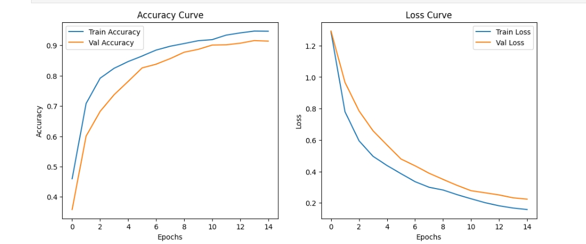
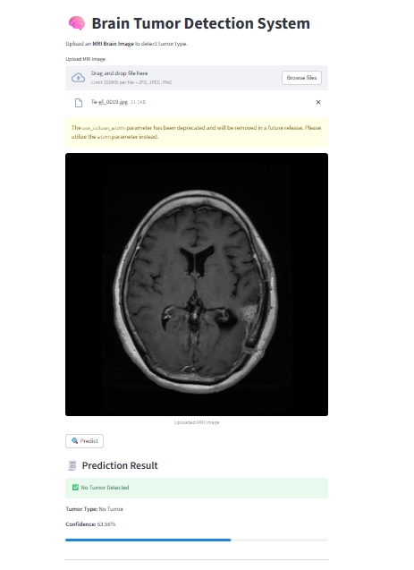

# Project Overview 
This project introduces a Computer-Aided Diagnosis (CAD) system that leverages Deep Learning to automate the detection and classification of brain tumors from MRI images.
I implemented a Transfer Learning approach using the MobileNetV2 architecture. This choice was strategic: MobileNetV2 is an "Edge-AI" optimized model that provides high accuracy while remaining computationally efficient enough to run on standard hospital hardware or mobile devices.

## ✨ Key Features
Multi-Class Classification: Successfully categorizes MRI scans into four distinct classes: Glioma, Meningioma, Pituitary, and No Tumor.
Real-time Inference: Designed for low latency, allowing near-instant feedback upon image upload.
Interactive Dashboard: A user-friendly web interface built with Streamlit, enabling users to upload images and visualize prediction confidence scores directly.
Advanced Preprocessing: Includes automated contour detection to crop MRI images precisely to the brain region, improving the model's focus and accuracy.

##🔬 Architecture & Methodology
This project utilizes Transfer Learning with the MobileNetV2 architecture. By using a model pre-trained on the ImageNet dataset, the system leverages existing knowledge of shapes and textures, which is then fine-tuned to identify the specific features of brain tumors.

## Why MobileNetV2?
Iverted Residuals: Efficiently passes information through the network.
Linear Bottlenecks: Prevents non-linearities from destroying too much information in low-dimensional spaces.
Depthwise Separable Convolutions: Dramatically reduces the number of parameters compared to standard CNNs.

## 📂 Dataset Structure
The model was trained on a dataset containing 7,023 MRI images. The data is organized into four classes:
### Glioma:
A type of tumor that occurs in the brain and spinal cord.
### Meningioma: 
A tumor that forms on the membranes that cover the brain.
### Pituitary:
Tumors that grow in the pituitary gland.
### No Tumor:
Healthy brain scans.
### Accuracy and loss 

## **Frameworks:** TensorFlow, Keras, Streamlit
## 🖥️ Application Demo

## 🛠️ Detailed Setup Instructions
## 1. Create a virtual environment
python -m venv env

## 2. Activate it
### On Windows:
.\env\Scripts\activate
### On Mac/Linux:
source env/bin/activate

## 3. Install Requirements
pip install -r requirements.txt

## 4. Run the Streamlit App
streamlit run app.py

## ⚖️ Disclaimer
This application is designed for educational and research purposes only. It is not intended to be a substitute for professional medical advice, diagnosis, or treatment. Always seek the advice of a physician or other qualified health provider with any questions you may have regarding a medical condition.

## 📬 Contact
## Name - Nabonita Roy ; 
## Project Link: [https://github.com/NERDYNEKO/TumorVison-Brain-Tumor-Detection-System-/tree/main]; 
## emailID- nabonitaroy15345@gmail.com ;
## linkedin - [www.linkedin.com/in/nabonita-roy-04r]
